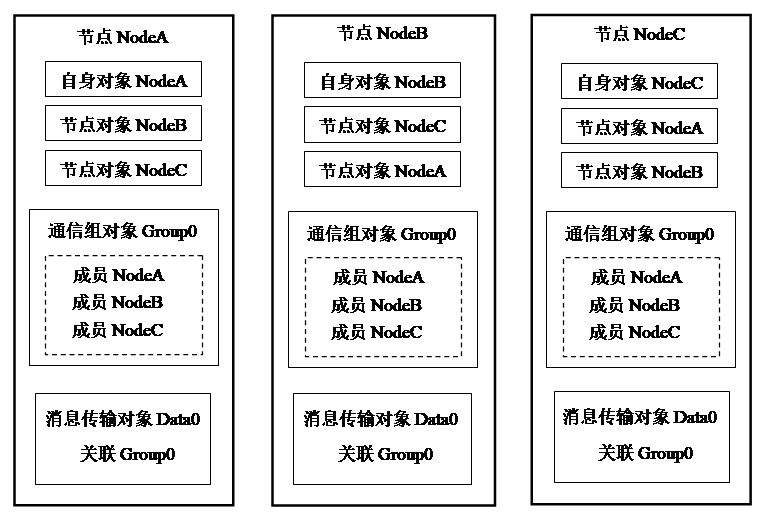

## 3\. 基于对象的多点通信会话 {#3}

### 1) 概念 {#1}

在以往的网络编程方法中，例如，TCP连接、SIP会话等，通信会话一般指两点之间协商建立起来的通信交互。且也已经有了相应成熟的网络编程模型，例如Socket API。但在对等通信应用中，通信交互往往是多点对多点的，而且参与通信交互的节点会动态变化。如果依然使用两点通信的模型去搭建对等通信应用，那将是相当复杂、困难的事情，需要富有经验的网络编程人员才能完成。我们能否找到一种方法，让对等通信编程也变得直观、简单呢？其实，人们使用网络的行为可以简单表达为一句话：“多个人通过网络连接在一起做同一件事”。比如，多个人在一个聊天室里交谈、多个人在顶一个帖子、多个人在观看一个视频等等。我们可以把其中的“多个人”抽象为多个通信节点，“同一件事”抽象为一个通信会话，也就是把使用网络的行为抽象为一个“多点通信会话”。两点通信会话与多点通信会话的比较示意图，如下：

(a) 两点通信会话连接，(b) 多点通信会话连接

进一步，我们把一个多点通信会话封装成一个通信对象，用面向对象的方法来表述网络通信的特征，这样就使对等网络编程变得更加简单、直观。Peergine就是这种以通信对象为基础的对等通信系统。在系统中不同的通信业务类型表述为相对应的通信对象类，例如消息传输类、音频传输类、视频传输类等，而每一个通信对象实例表示一个通信会话。

### 2) 同名通信对象 {#2}

Peergine系统中的一个通信对象通过一个名称来标识。每个通信节点有一个节点自身对象，其对象名称就是节点的名称，这个节点自身对象的名称必须是整个网络中唯一的。在每个通信节点上除了节点自身对象以外，还可以创建多个各种类型的通信对象，这些通信对象的名称必须在本节点范围内唯一。在不同的通信节点上就可以存在名称相同的通信对象，我们把这样的一套通信对象称为“同名通信对象”。在Peergine系统中，一套同名通信对象就是一个多点通信会话。位于不同节点上的相同名称的通信对象之间自动地建立起通信会话，然后在其中一个节点上调用该对象的方法，就可以完成与其它各节点之间的通信交互。同名通信对象建立通信会话的过程，称为“通信对象的同步”。

如下图，有NodeA、NodeB、NodeC三个节点，它们的自身对象分别为 NodeA、NodeB、NodeC。在节点NodeA可以创建一个节点对象NodeB与节点NodeB的自身对象同名，这时节点NodeA上的NodeB和节点NodeB的自身对象就是同名通信对象，它们之间自动建立会话连接。同样节点NodeA、NodeB、NodeC上都有通信组对象Group0和消息传输对象Data0，它们都组成相应的同名通信对象。

同名通信对象机制

### 3) 通信范围控制 {#3-0}

当很多节点上都有名称相同的通信对象时，如何确定哪些节点上的同名通信对象才能组成一个多点通信会话呢？这就涉及到同名通信对象的通信范围问题。在Peergine系统中有两种可以用来确定通信范围的通信对象，它们分别是节点对象和通信组对象。对于节点对象，它的通信范围由对象名称决定。例如上图中，在节点NodeA上创建节点对象NodeB，它跟节点NodeB的自身对象同名，所以它的通信范围就是节点B。使用节点对象可以建立两点之间的通信会话。对于通信组对象，它的通信范围由它所包含的组成员决定。通信组对象的成员就是其通信范围内的节点的自身对象的名称。添加或删除通信组对象的成员可以改变通信组的通信范围。使用通信组对象可以建立多点之间的通信会话。对于其它业务类型的通信对象，例如消息传输对象、文件传输对象，它们没有控制通信范围的机制，则可以通过关联节点对象或通信组对象来控制通信范围。当它们关联节点对象时，实现两点之间的通信交互，当它们关联通信组对象时，实现多点之间的通信交互。一个节点对象或通信组对象可以被多个通信对象关联。参考“[使用通信组类](..\jie_dian_gong_neng_lei_de_bian_cheng_can_80033a\3_pgclassgroup_7c7b3a.md)”章节。