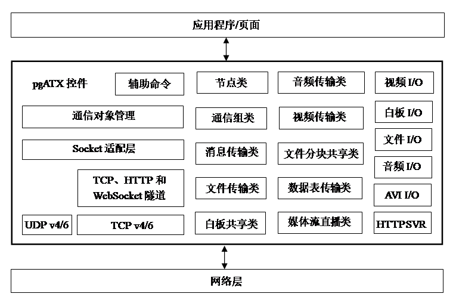
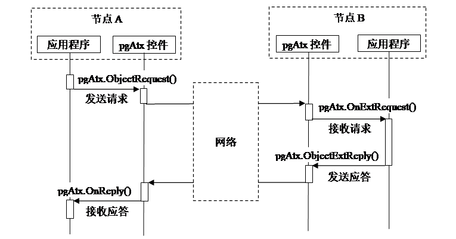
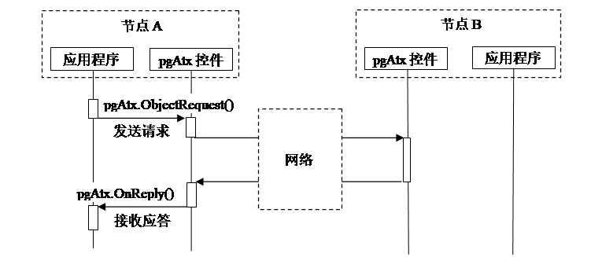
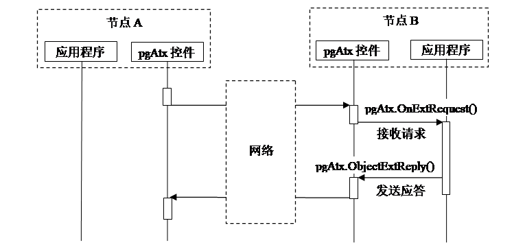
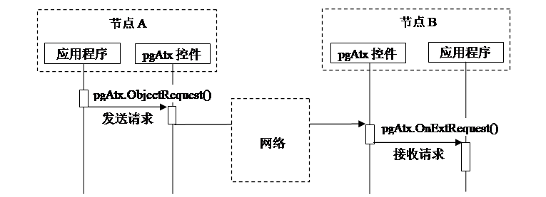
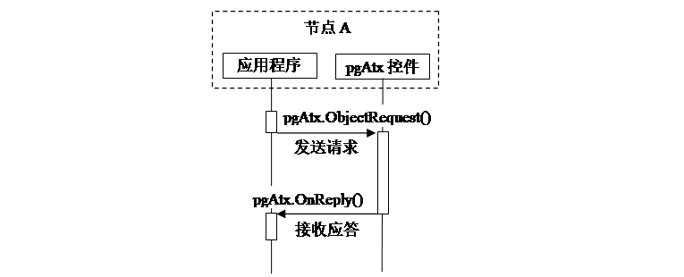
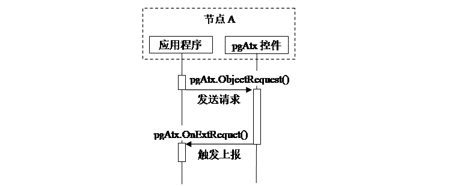
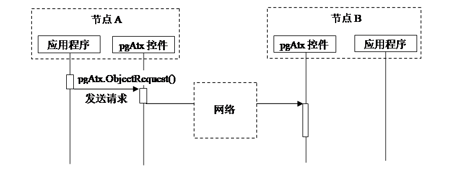

## 4\. 控件与应用程序的交互方式 {#4}

### 1) 系统概述 {#1}

Peergine中间件的系统框图如下，它位于应用程序和网络层的中间。上方通过控件提供的API与应用程序交互，下方通过OS的Socket API与网络协议栈交互。

系统框图

调用通信对象类的方法时，应用程序与pgATX控件之间的交互通过4个编程接口来完成。分别为发送请求ObjectRequest()、接收请求OnExtRequest()、发送应答ObjectExtReply()和接收应答OnReply()，其中OnExtRequest()和OnReply()是回调函数，需要在控件初始化时注册才能使用。但并不是所有的方法的调用都需要4个函数的交互过程，有些方法只需要其中1个或2个函数的交互。Peergine系统用到的交互方式由下文的小章节逐个说明。

### 2) 方式1： {#2-1}

本端应用程序发送请求、接收应答。对端应用程序接收请求、发送应答。

交互方式1

### 3) 方式2： {#3-2}

本端应用程序发送请求、接收应答。对端控件接收请求、发送应答。

交互方式2

### 4) 方式3： {#4-3}

本端控件发送请求、接收应答。对端应用程序接收请求、发送应答。

交互方式3

### 5) 方式4： {#5-4}

本端应用程序发送请求。对端应用程序接收请求。

交互方式4

### 6) 方式5： {#6-5}

本端应用程序发送请求，本端应用程序接收应答。

交互方式5

### 7) 方式6： {#7-6}

本端应用程序发送请求触发本端控件上报事件给应用。

交互方式6

### 8) 方式7： {#8-7}

本端应用程序调用本端控件的方法但没有输出。

交互方式7

### 9) 方式8： {#9-8}

本端控件自行上报事件给应用程序。

交互方式8

### 10) 方式9： {#10-9}

本端应用程序发送请求、接收应答。对端控件接收请求并在控件内部处理。

交互方式9